# Framkvæmd

## Gerð á móti

Við hönnun á mótinu fyrir toolpath þarf að hafa amk 5mm pláss fyrir botn í frauðplastinu og 25mm frá búknum yfir í vegginn á frauðplastinu svo það sé nægt pláss fyrir putta til að taka búkinn úr frauðplastinu. Það eina sem heldur þá búknum föstum við frauðplastið að fræsingu lokinni er 5mm botninn.

Þar sem CAD módelið okkar var 55mm á hæð en frauðplastið bara 50mm ákváðum við að líma saman tvær plötur af frauðplasti (eina 50mm og aðra 25mm) svo heildar hæð frauðplastsins væri 75mm sem dugar fyrir okkar módel. Við hefðum líka getað skipt módelinu í tvo parta og límt það saman eftirá en okkur fannst þetta nákvæmara.

## Vél og búnaður
Verkefnið var unnið á Shop Bot PRS5 Alpha sem er CNC fræsir sem er ætlaður til að fræsa plast, frauð, ál og fleira. Sem er svolítið overkill fyrir okkar frauðplast en virkar vel. 

## Fræsibitar
Fræsibitinn sem er notaður í að fjarlægja mest allt efnið er 10mm flat end karbít biti.

Fræsibitinn sem er notaður í fínpússun er 12mm karbít biti sem minnkar niður í 6mm á endanum (tapered).
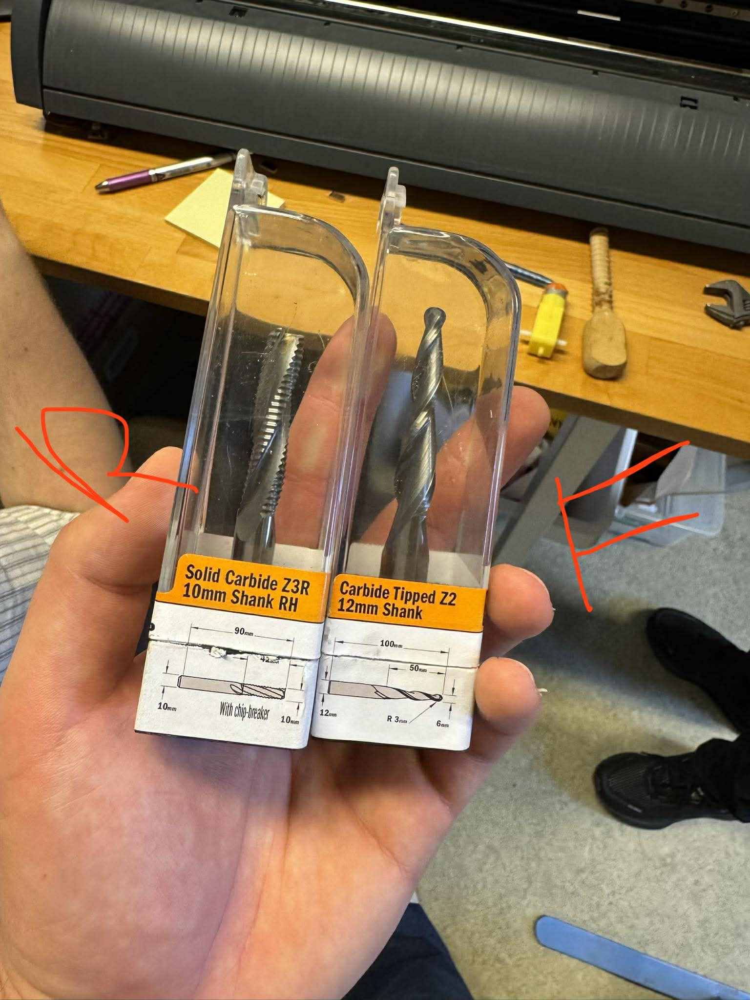   

Til að skipta um fræsibita í Shopbot er notast við tvo fasta lykla til að losa gamla bitann og kollettuna úr, svo er mikilvægt að hafa í huga að það eru mismunandi stærðir á kollettum fyrir mismunandi stærðir á bitum.
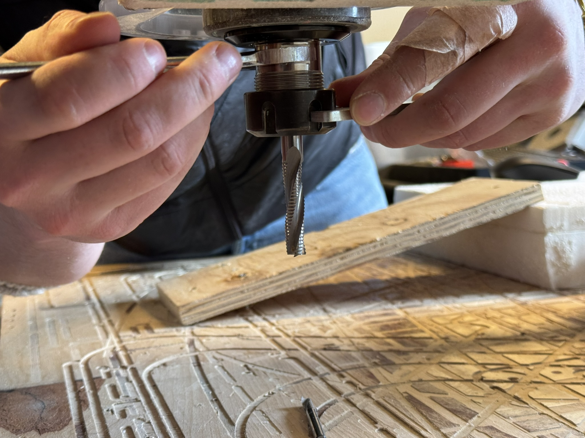   

## Undirbúningur
Fyrst var að festa mótið við shopbot vinnusvæðið og dugar þá ekki að skrúfa það niður eins og venjuleg timburmót þar sem frauðplastið er mjög mjúkt, svo við enduðum á því að setja timbur á ská ofan á mótið til að halda því niðri ásamt því að líma það niður til að stöðva hreyfingar í XY-átt. Svo þegar timbrið er skrúfað niður festist plastið í Z-átt. 

Hættan við það er að fræsibitinn, spindillinn eða ryksugan geta nú rekist utan í timbrið þar sem það er ekki inni í toolpaths svo við fórum vel yfir það ásamt prufum til að sjá til þess að það myndi ekki gerast.
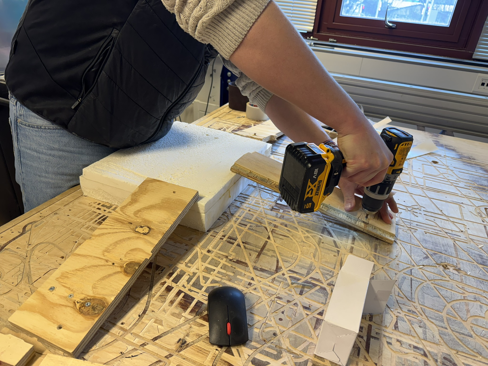   

Næst var að núllstilla Z-ásinn og til þess er notuð járnplata til að setja á milli frauðplastsins og fræsibitans svo fræsirinn viti hvar á að byrja.

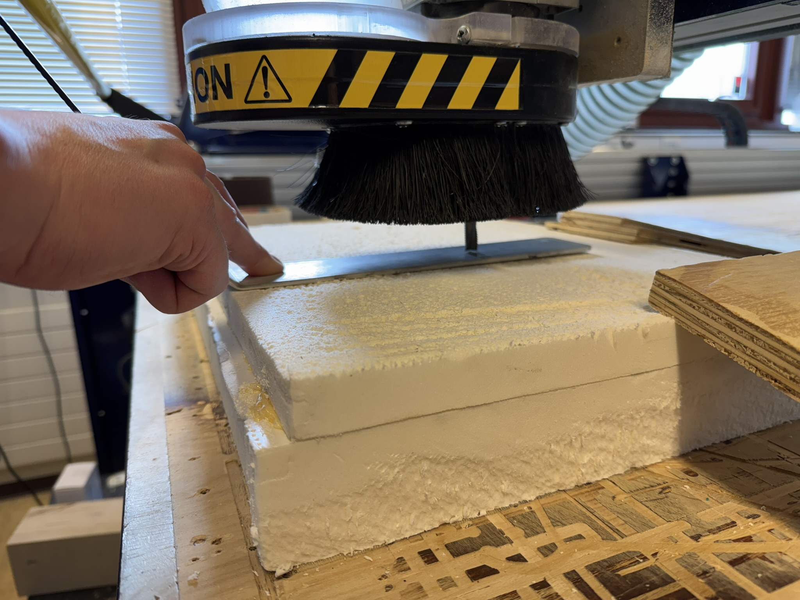   

## Roughing
Frauðplast er mjög mjúkt og auðvelt í vinnslu og er því notað mjög hátt feedrate/hraði. Einnig er tolerance 10mm frekar hátt til að lágmarka tíma en það hefur engin áhrif á módelið þar sem finishing fer yfir það aftur.

Feedrate á roughing er 5000 mm/min

Spindle speed er 12000 rpm

Tolerance er 10mm

Í roughing er stærri biti notaður til að taka sem mest efni í burtu á meiri hraða og með minni nákvæmni. Ef þetta væri ekki gert þá myndi fræsingin taka töluvert lengri tíma ef það væri notaður fínn biti í allt mótið.

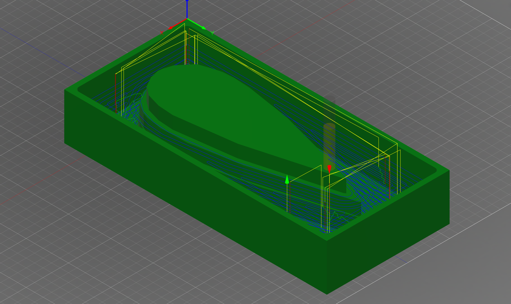   

## Finishing
Hér minnkum við feedrate til að fá betri yfirborðsáferð.

Feedrate á finishing er 3000 mm/min

Spindle speed er 12000 rpm

Tolerance er 0.5mm

Í finishing tekur hann tvær ferðir, annars vegar tekur hann "passes" í x átt, og svo þegar hann er búinn af því yfir allann búkinn tekur hann "passes" í y átt. Það er til þess að jafna úr ribbunum sem myndast þegar hann fer í x átt því fræsibitinn skilur eftir rauf í hvert skipti.

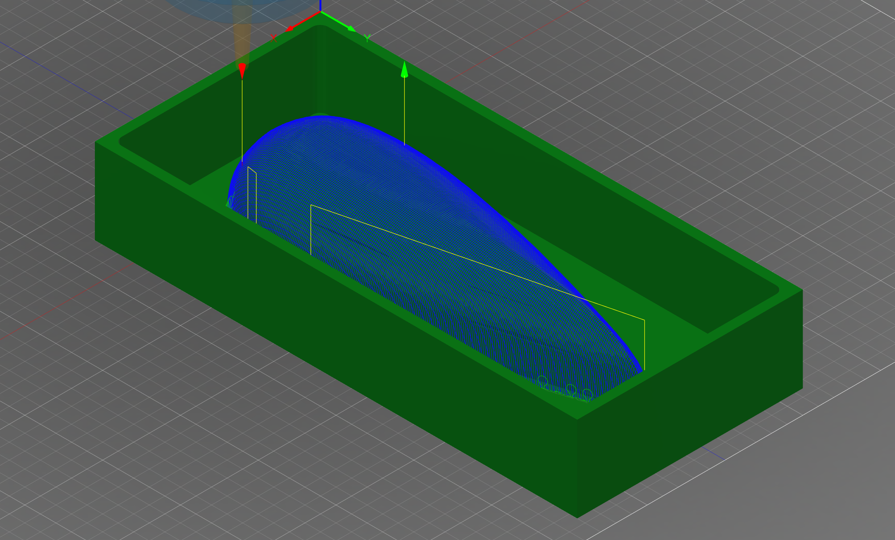   

## Mótun á efni við frauðplastið.

Til að móta svo strigann við frauðplastið þarf að fylgja ákveðnum skrefum. 

Til að byrja með er mótið penslað með vaselíni svo það sé auðvelt að ná mótinu af þegar það er harðnað.
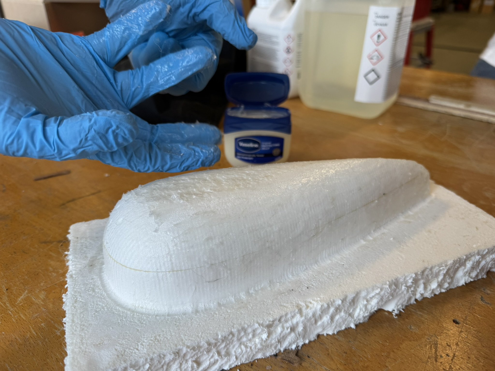 

Síðan er epoxy resin blandað með herði í réttum hlutföllum og hrært saman. Eftir það er striginn mótaður að frauðplastinu og epoxy resin penslað yfir. Hér þarf að passa að hafa hvorki of lítið né mikið af resin.

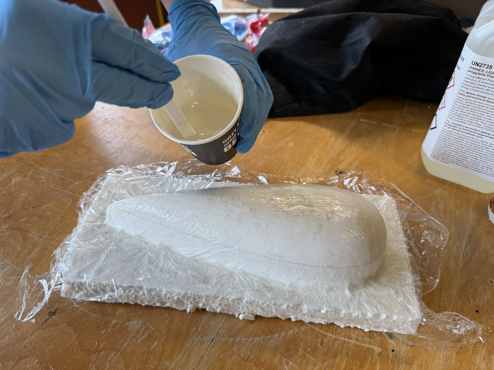

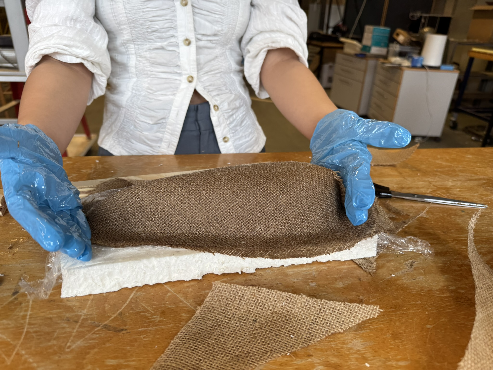

Svo eru þessi skref endurtekin þangað til við höfum 3 lög af striga og epoxy. Best er að snúa hverju strigalagi 30° svo hann liggi ekki alltaf í sömu átt fyrir mestan styrk.

Að lokum er sett matarfilma sem er götuð á efsta lagið af striga.

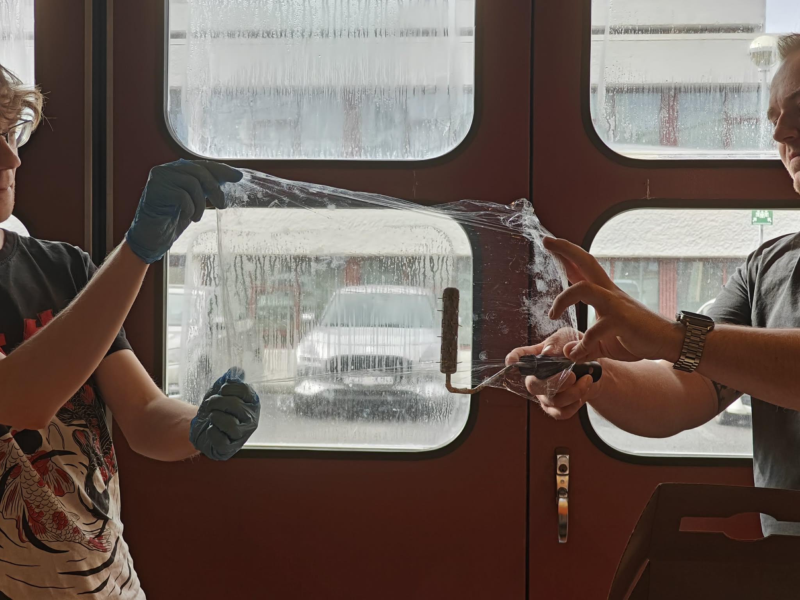

Og svo settur svampur yfir filmuna og sett í lofttæmingarpoka. Filman er sett á til að epoxy-ið límist ekki við svampinn og svampurinn er til að allt auka resin sogist í hann þegar loftið er tæmpt úr pokanum. Pokinn gerir það að verkum að formið haldist á meðan resin-ið harðni yfir nóttina.

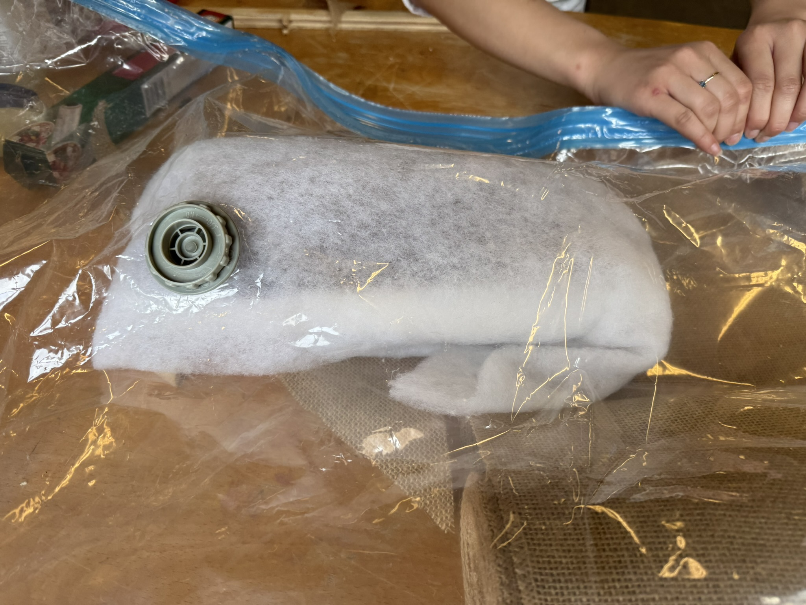   
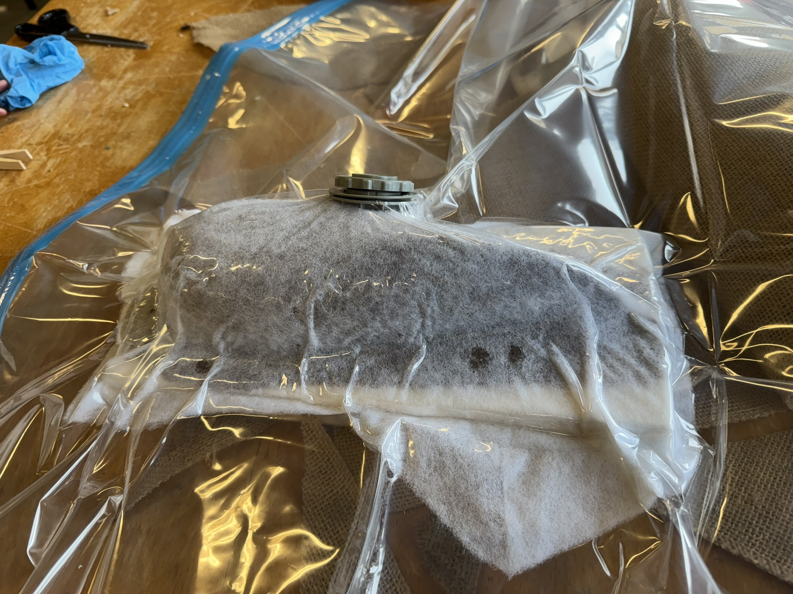  

Svo þegar þetta er búið að harðna yfir nótt er mótið tekið úr pokanum og svampurinn, frauðplastið og matarfilman fjarlægð og lokaútkoman fer að taka á sig mynd. 

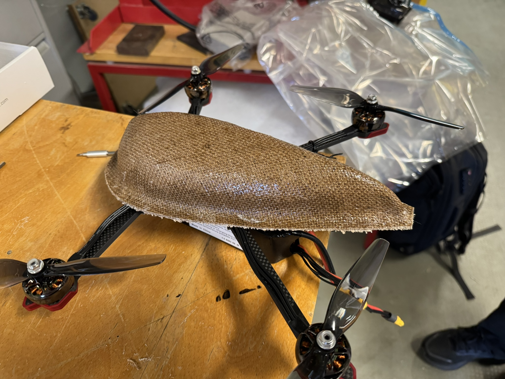  

Eina sem á eftir að gera er að saga göt fyrir fæturna á drónanum og bora göt fyrir loftflæði ásamt því að setja festingar.

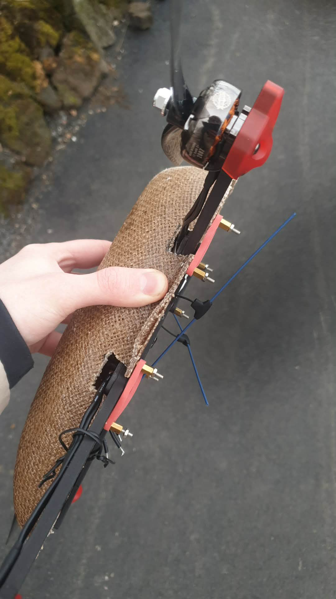   

Lokaafurðin lítur svona út og má sjá að festingarnar eru boltar sem eru festir saman með teygjum. 

