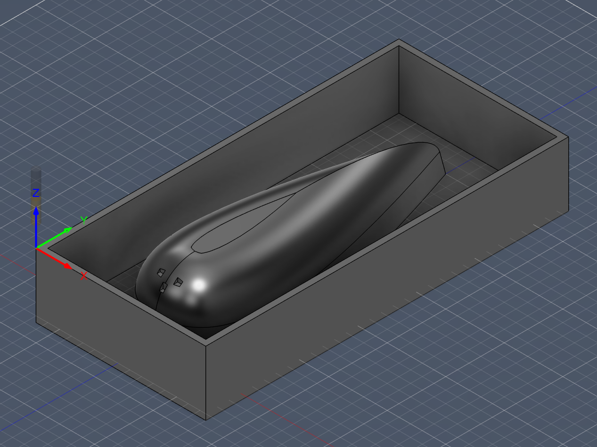

# Hönnunarferli

## Hugmyndavinna
Hér verður fjallað um fyrstu hugmyndir og val á endanlegri lausn.

## Skissur
Setja inn skissur og útskýringar.

## CAD líkan
Hér verður lýst hvernig líkanið var hannað í CAD og hvaða breytingar voru gerðar á leiðinni.

## Endanleg hönnun
Hér verður kynnt endanleg útfærsla verkefnisins.  

## upplysingar-eyða-seinna
Til að setja mynd í docs/efnisval-og-msds.md 

   
